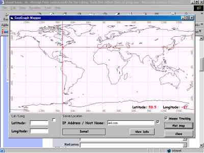



## GeoGrapher Updated

### Description

GeoGrapher Updated. Now with Limited IP Address / Host Name Resolution to area using zip codes, I have added a MS Access DB using DAO 3.51 - make sure you have that installed if you have problems, Also added the Lat and Lon to the mouse tracking. Please let me know what you think of the application and vote for it if you like it. Also please email me with any bugs you find so I can fix them, I will be working on this app this weekend.
 
### More Info
 

             |
---                |---
**Submitted On**   |2003-02-07 18:16:50
**By**             |[John Phillips](https://github.com/Planet-Source-Code/PSCIndex/blob/master/ByAuthor/john-phillips.md)
**Level**          |Advanced
**User Rating**    |4.7 (14 globes from 3 users)
**Compatibility**  |VB 5\.0, VB 6\.0
**Category**       |[Miscellaneous](https://github.com/Planet-Source-Code/PSCIndex/blob/master/ByCategory/miscellaneous__1-1.md)
**World**          |[Visual Basic](https://github.com/Planet-Source-Code/PSCIndex/blob/master/ByWorld/visual-basic.md)
**Archive File**   |[GeoGrapher154083272003\.zip](https://github.com/Planet-Source-Code/john-phillips-geographer-updated__1-43023/archive/master.zip)

